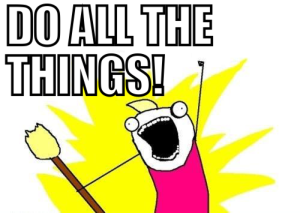

> To start with total honesty, I don't know what I want to do right now. 

I want to be working as a software dev and playing games at night. Occasionally going on hikes with my partner and dog, or hanging out with friends. But the specifics of how to find that next job, what sub-section of the field it should be in, what industry, all that stuff - not so clear. 

That's also a lot of the inspiration for starting a blog again - the ability to track my career as an actual path, celebrating the highs, sharing through the lows, and documenting the exploration of what I hope is a long career in software. 

But let's back up for a minute.

## A Little History

Hi. I'm Linda. Welcome to my little space on the internet. I'm so glad you're here! 😊

I started exploring the idea of software engineering as a career back in 2016 by taking free online courses. I quickly fell in love with being able to build websites and see my creations in near real time. Through the next 6 years, I studyed and built projects whenever I had the energy after my day job. 

Then the pandemic hit, and I was forced to make a choice - go back to the job that was draining me for years only 2 months into the pandemic, or quit and actually try to make this career switch into tech happen. I chose the latter, and I'm forever proud of myself for taking the riskier choice. 

I went to college (and finished a bachelor's degree) for general music - honestly as useless as it sounds, although I did gain a lot through my experiences. I have regrets around finishing this degree, but I got to learn and play with so many instruments and made friends and had my first real taste of independence. I learned to fend for myself and do what was needed to keep myself afloat. But I knew I didn't want to be a performer (I'm not competitive enough) and I learned I didn't want to teach, so my options were slim. 

I mostly did random retail / customer service / office administration jobs. I got to work at some cool places, like developing film at pharmacies, a piano store,  and a print store. But lots of those places also were either directly toxic to my mental health or it was blaringly obvious that we were all only there for a paycheck and were expendable. None of it was stuff I was proud of - it was just a job. I wanted more.

## Recent Experience

It took a year of actively searching through the pandemic, but I landed my first role in May of 2021. I was an apprentice, then a full time software engineer, then hit level 2 in my 2+ years with that company. I truly loved my time there - there was a strong culture of respect and learning and giving back to others, and it was such a fun experience. We only parted due to a layoff, which can happen at any company even if they love you. We parted on good terms, which I'm thankful for.

But even in my last year there, I'd felt myself stagnating. I knew I'd grown so much from being actively employed and paid to do software, but I couldn't figure out what to dig into next, and I was painfully aware of how things were slowing down. Even still, when I'm now a free agent and can dig into anything or go anywhere, I still just...don't know.

## The Path Ahead

So that's a lot of what I hope this blog will be. 

An exploration of my career options, how I'm feeling on certain ideas, where I think I want to go and why. 

Sharing the ups and downs of the journey, and being able to see my career path develop over the years.

And also a place to share things I'm learning or find interesting.

I'm confident a new job will come along when it's time. I know that sounds a little clichè and naive, but I mean it. I'm completely confident in my ability to build projects and persist through the pain of the job search process and eventually find a place that feels right and gives me an offer. I've done it before, afterall, so I know it's possible. But it's also tough and I'm human, and I want to talk through that side as well. I'm an optimistic realist, after all - I know progress is never linear, but I want to talk through the good and the bad of it all, be transparent in who I am.  

So, if you see this post - I'm glad to have you along for the journey. 💞 I hope I'll keep sharing posts that you find interesting and helpful! And if not, that's ok too. In the end I'm writing for myself, so if I'm the only person I help here I'm perfectly okay with that. 

Now, let's go build and share all the things! 
