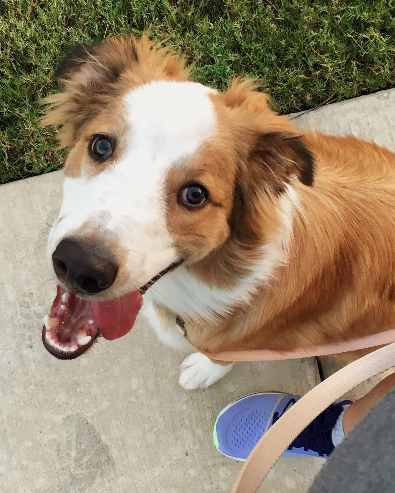

2023 was not the best year to me.

It was a year of smaller amounts of growth, stagnation, and heartbreak. I've learned myself better and am starting to notice some mind shifts happening that are going to lead to great things down the road.

So let's dig into what happened and see what we can learn from it.

## The Good

The biggest life event this year was bringing Gizmo into our lives. He's completely changed our household, and it's already hard to imagine how things were without him. There's been a ton of hardship around adjusting to having a puppy and training him in the way we need him to be, but there's also been so much joy and happiness. He's so smart and sweet and his annoyances, while big to us, are not that terrible in the wider scheme of things. We really lucked out and found the best boy for our first dog as adults!

Other fun life wins from the year:

- I think I actually made some new friends this year. I definitely had some coffee chats and great Discord convos with some awesome folks!
- Got to take my niece to her first ever concert (Melanie Martinez).
- The Texas Rangers won the World Series for the first time ever! (Yes I know I'm not directly involved in this lol but they're my favorites and it was so fun to watch.)
- Went to an in person meetup in October to hear [Janelle Shane](https://twitter.com/JanelleCShane) talk about what AI can and can't do! Really interesting talk, and I actually chatted with people (including Janelle!) before and after, which is huge for me!

Even though growth felt a lot slower career-wise this year, looking back I definitely did keep leveling up:

- I learned and played around with new frameworks (XState and Shopify).
- I attended classes, studied for, and passed the Contentful Partnership exam (all within 2 weeks).
- I did some open source work, building out a starter kit for [starter.dev](https://starter.dev) in Vue and XState, and helping get a complex Angular project ready to be open sourced and fixing some existing issues.
- Also did some private company work, mostly focused around the company's blog and how posts are discovered and displayed.
- I got to write a recommendation algorithm from scratch! This was such a fun rabbit hole to go down, and I'm actually really pleased with how it turned out and the solution I came up with. Bonus points that I got compliments from multiple developers afterwards for how well commented and organized the code is!

And I was able to keep investing in my side projects and network too:

- I gave my first public presentation at the Women in Tech mentoring session in October!
- I migrated my personal site (the site you're on right now!) from Nuxt to Astro, and started using [FrontMatter](https://frontmatter.codes/) as my CMS. Also a fresh coat of paint for the styles, and a new light theme!
- I added more games to my arcade site, and made great progress on some design changes so that it can relaunch early this year.
- I got to take and complete the [Joy of React](https://www.joyofreact.com/) course, which was a wonderful resource.

The best part of so many of these things is that they layer and impact each other. I was able to use the stuff I was learning in Joy of React and while studying for the Contentful exam to improve the projects and codebases I was working on more than once. I got a lot of practice understanding large codebases and taking the frustration to euphoria pipeline. lol Working on all these tasks I created a lot of architecture design docs, which gave me great talking points that I used in my presentation on documenting your progress. It all feeds into each other, and it's really nice when you can directly see how.

## The Bad

Like most people, I have some general gripes about the year:

- Adjusting to our first dog, and a puppy no less, has been _a lot_ and has caused more than it's share of disagreements and tense moments in the house. We're reaching a good point here thank goodness, but to act like it wasn't rough wouldn't be the truth.
- I knew I felt stuck in my current role earlier this year, but I didn't know enough to know what to do about it. I was looking outward too much, hoping others would be able to guide me because I sure don't know what the heck I'm doing most of the time. lol But that wasn't fruitful or fair to anyone else. It's ok and normal to be curious how others do things and what their "secrets" are for success, but at some point you have to handle it for yourself, and I didn't.

But I got hit hard 4 times this year:

- Early February, my partner's dad passed away.
- Early June, my stepmom passed away.
- End of June, we had to make the choice of rehoming one of the two puppies we got because we just couldn't properly handle two.
- Mid August, I got laid off from my first (and best) tech job.

It just didn't stop this year, and I don't think I realized for a very long time just how badly it all affected me. Any one of these situations would be emotionally draining for lots of people, and I dealt with one every few months this year. It's no wonder I've been striving so hard just to have some calm in each day.

## The Lessons

So, what can I use from this year? Of these big bads and so many decent wins, what can I learn?

- Allow yourself to grieve, even if it feels weird. It's ok to be hurt by the things that hurt you.
- Don't forget that you still made big strides in your learning and experience this year, and that will pay off for you.
- You're still standing and trying to move forward after all of this. You're a badass.
- Keep prioritizing the monthly mentoring sessions. Those have been so good for your soul and your network - that's a space where you belong.
- You can do hard things, if you can just push through the hard parts. Your natural patience and resilience is your biggest strength here. Keep using them.
- You know more than you think. You can trust your gut more, and lean into action more.
- Keep making time for learning new things. Write code just to play with it, follow courses, read blogs, watch streams. Don't lose that.
- The things you want to do mean you have to get used to being observed, and not be afraid to be yourself around strangers. I know there's lots of reasons this is a big deal for you, but it's time. I believe in you.

## Final Thoughts

I'm usually the kind of girl that _loves_ planning and setting goals and all of that. But I've been thinking about this a lot and I don't think it actually serves me. I basically never reach those goals, or take the time to break them down into next steps so that I can actually be successful with them. It just makes me feel bad every January 1st. There's no need to put myself through that.

I started doing a "word of the year" thing a few years ago, which I like the idea of better.

In 2021 it was grit. This was the best one so far, the most inline with how I felt. And I got my first job in tech this year, so my grit really came through for me.

In 2022 it was manifest. Now that I had the job, there were so many things I wanted to do. It didn't work out at all like I thought. But I did still get promoted and grew a lot, so it felt ok overall.

In 2023 it was build. I wanted to focus on my foundations - build up my skill, my finances, etc. This year didn't turn out that way at all. It became more about surviving and processing and staying afloat.

But I did still manage to build some this year. I built new friendships, continued improving my skills. I'm even starting to tear down some of my personal demons and rebuild healthier brain wrinkles, change how I think about and view my world and my place inside it. It's good to remember that it wasn't a complete loss of a year.

So many of the things I want for myself are big, abstract, long-term ideas that are really hard to put into SMART goals. I'm tired of dreaming big and only dreaming. So this year, though I may not ever set specific goals or pick a word for the year, my intent is to focus on setting up and improving the systems and habits in my life so that my life better suits me, and allowing myself to feel and take up space and be uncomfortable. It should be a year of being seen and finding clarity and being more present.

I'm trying to remind myself to consider life an adventure. So let's hit the road and see where it takes us. 💖
