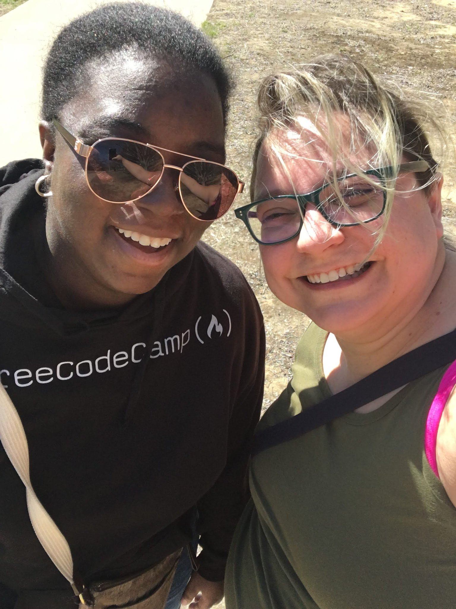

I don't get the sense that 2024 was a particularly great year for anyone, myself included. I certainly hoped I wasn't going to end it the same way I started it - unemployed and bummed out. Yet here I am, still in the same boat. 

That's also not quite true. I am still unemployed and very bummed out about it. But I've learned more about myself, had some soul-filling experiences, and am still hopeful. These signs tell me there's still a chance for me, and I'm not giving up. 

There is no clear good and bad for me this year. Just memories and growing pains. So for this post, I'd like to highlight the memories I want to remember, and do some reflection on the year as a whole.

## My favorite memories of 2024

Without a doubt, the best parts of this year involved the people I got to meet. 

I started the year with the amazing THAT Conference. I [wrote about my full experience in a previous post](https://www.lindakat.com/blog/my-that-experience/), and I still stand by it. What a great time.

I got to meet the lovely Jessica Wilkins in person, which was such a treat.

I went to a local Tech Ladies meetup, where I got to see a giant Cheetos statue and hang out with funny, smart ladies partly in the meeting room and partly in the basement due to a tornado warning. Oh Texas. lol 

I got to participate in the Journeys conference, and was able to be a small contributor to helping Jacob Ashley's family deal with a major health hiccup. I rarely get to actually help with things like this, so even though my part was small getting to play a part at all made me feel good.

I went to two live events that had nothing to do with my career. The first was seeing Richard Dawkins, the second was seeing one of my favorite podcasts And That's Why We Drink. Very different vibes lol but I really enjoyed both of them.

I built two mini-sites for games I enjoy. The first was a companion site to build crafting lists in Lego Fortnite. This site was short lived but gave me a little intro to AstraDB and vector databases. The second was a timer reset countdown site for Once Human. Short and sweet NextJS and Luxon site - at least if you don't count the handful of time/date bugs I had to go back in and fix after I launched it. lol 

Then I ended the year with another amazing conference, Commit Your Code. I saw most of the friends I made in January, made a few new friends and met important people from my career in person, all at the same time. I didn't write a blog for this one but did do a series of LinkedIn posts about the talks I attended, so [if you're interested you can see those here](https://www.linkedin.com/search/results/content/?fromMember=%5B%22ACoAAAnWzpUBgMRlgU1cuy0pWn0YvCu3d-DUADw%22%5D&keywords=%23commityourcode&origin=FACETED_SEARCH&sid=jBw&sortBy=%22date_posted%22).

## Reflecting on the year

This year is a difficult one to pick wins or losses from. It was a very muddled, messy year overall for me. But even in the muck there are lessons we can learn. I found a few reflection-style questions that sounded interesting, so I wanted to answer those here.

> What are three (or more!) accomplishments you made in 2024? What personal strengths led you to these accomplishments?

I expanded my network. I intentionally went into THAT with the goal of talking to other people, forcing myself to step into conversations and introduce myself. Putting myself out there like that is not something that comes naturally to me, so to have the bravery to do it and be so warmly welcomed each time I did was such a blessing. And I saw this same effect at Commit Your Code as well, even with less intention to put myself out there. It is growing, and I appreciate everyone in it.

I'm still here, and still trying. I knew this year was going to be a struggle since my layoff wasn't fresh, but I didn't realize just how impacted my mental health was from it all (and still is if I'm being honest). I wish I could say that I gave the job search my all and it's all been out of my control, but that wouldn't be the complete truth. I have tried and have been rejected - but I've also had to let myself slow way, way down and be ok with simply surviving most days. My current best isn't what my "true" best has been in the past, and it's hard to come to terms with that. But it IS still my best right now, which is all I can do. I'm not giving in, and this won't defeat me. I will work in tech again.

I read 24 books this year. They were all fiction, a mix of fantasy, romance, and thrillers. I really do love reading, and am really pleased I got to read as much as I did this year. 

> How did you show up for yourself this year, and how can you show up for yourself right now?

I do think I gained some deeper understandings about myself this year. I've been letting myself feel all the hard feelings around my career and life, no matter how often they keep popping up, and trying to just feel them and let them go. It's a work in progress. I've also started realizing I'm very likely some form of neuro-divergent, and trying to lean into understanding some of that and viewing a lot of my life through a different lens.

The biggest thing I know I'm missing right now is structure. I do my best work when I have a schedule and routine to follow, and being on my own it's very difficult for me to both come up with that structure and to follow it. So this will be a huge way I can show up for myself in the coming year that will allow me to finally start seeing forward progress again.

> What can you forgive yourself for from this past year? What mistakes did you make that you can learn from?

I forgive myself for missed opportunities. For the open positions I knew sounded good and I would've loved but just could not get myself to get it together enough to apply for. For all the mean thoughts I've had about my struggles to do the job search things that other people seem to do effortlessly. 

I keep thinking about a post I made on Twitter back in April or May about a project I was going to do and live stream, that I then....never did. I forgive myself for that as well. I was trying to put myself out there and do the thing scared, because I do still hold this idea in my head of streaming, both coding and playing games. I don't even have a good reason for myself for why I never did it. I could say it's that I don't particularly care about the project anymore which is true. Or that I got nervous, that my equipment isn't right, that the idea of being perceived and critiqued became too much to overcome. Some aspects of all of those are true, but none of them are the deciding factor in why it never happened. It just...didn't. And it's hard not to think that me not following through on this public statement is part of why my career has stalled. 

So I forgive myself for all of that. I know not to post things before I do them because I do struggle with the follow through and it makes me look bad. So a reminder for myself on that. But it also likely wasn't a noticeable thing to anyone but me, and that's ok too. Today's world moves much faster than I do, so I can almost always start fresh and succeed. 

## The year ahead

I think part of why this year felt so aimless was that I didn't set any goals or intentions for myself. Part of me actually still agrees with this idea and likes it, but I'm also feeling the itch to "start fresh" and have something defined to work towards. I don't know what this will be just yet - I just got done saying I don't do well when I talk about things before they happen! lol So whatever I decide for this, it'll likely stay private until I make solid progress on it.

But I think the big thing for this year is going to be finding my own rhythm. I love organization and goal setting and routine, even as I struggle to hold myself accountable to them and also love the freedom of going with the flow and letting each day be different. So finding the balance between these aspects of myself, finding the way to build on my skills and specialize and actively job search in a way that doesn't make me lose my mind will be key. That's the real goal - how can I make this career sustainable for me, in all the different stages? I aim to find the answer to that this year.

